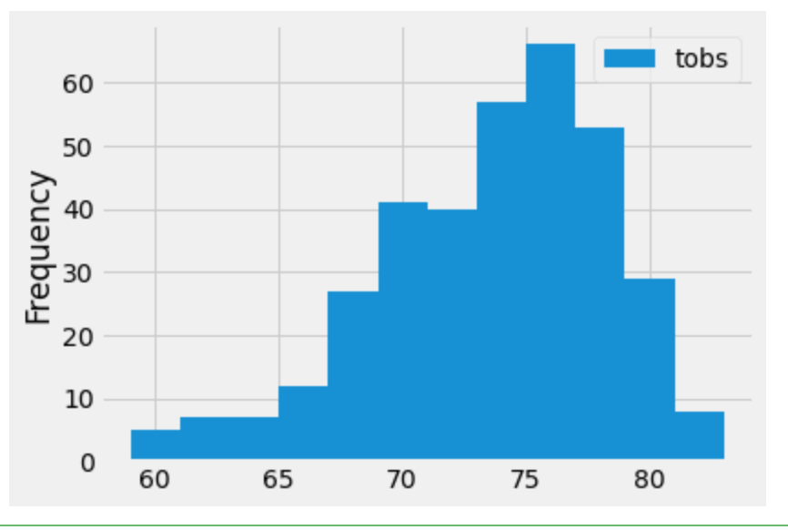

# surfs_up

## Overview
In this project, we are helping W. Avy to open his surf shop by analysing Hawaii weather data. By using python, pandas, and SQLAlchemy, we will retriev the weather data of June and December to determine if the surf and ice cream shop business is sustainable year-round.

## Results
### Precipitation
By looking at the precipitation data from 2016-08-23 to 2017-08-23, we noticed that the amount of rainfall vary a lot. In general, the amount of rainfall was lower in the winter month when compare to the summer month. From our summary table, the minimum rainfall was 0 and the maximum rainfall was 6.7. The average rainfall for the year was 0.17.

### Temperature
By comparing the temperature from different stations, the 75 is the most recorded temperature.

### June
* there are 1700 temperature records
* Minimum temperature was 64
* Maximum temperature was 85
* The average temperature was 74.9

### December
* there are 1517 temperature records
* Minimum temperature was 56
* Maximum temperature was 83
* The average temperature was 71

## Summary
By comparing the temperature different in June and December, we noticed that the minimum temperature in December is lower than June. The maximum temperature and average temperature doesn't vary a lot between the two month. In our conclusion, the surf and ice creas shop business is sustainbale year-round.
